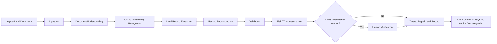

# 01 — Product Requirements

> Reading order: 1st. Start here.
> Related: [02-DOMAIN-MODEL](./02-DOMAIN-MODEL.md) · [03-WORKFLOW-AND-STATE-MACHINE](./03-WORKFLOW-AND-STATE-MACHINE.md) · [README](./README.md) · [DECISIONS](./DECISIONS.md)

## 1. Purpose

This document defines *what* LANDLENS must do and *why*, and establishes the traceability mechanism (`REQ-*` identifiers) that every other document in this set refers back to. It is the contract between the SIH 2026 problem statement ("Intelligent Land Record Digitization and Validation System") and the LANDLENS product.

## 2. Scope

Covers product-level requirements only. Technical design (database, pipeline, architecture) is deferred to the linked documents below; this document states *what* is required and *which category of source* each requirement comes from.

## 3. Source Categories

Every requirement in this document set is labeled with one of three tags, per the source-of-truth rule established for this project:

| Tag | Meaning |
|---|---|
| **[SIH]** | Explicitly required or strongly implied by the SIH problem statement / official documentation provided. |
| **[LLD]** (LANDLENS Design Decision) | A decision LANDLENS makes to implement an [SIH] requirement, or to make the product coherent. Not itself government policy. |
| **[FUTURE]** | Plausibly needed for a real government deployment, but not guaranteed available/achievable within the SIH prototype (e.g. depends on live government APIs). |

Where the SIH documentation is silent on a point, this document says so explicitly rather than inventing an answer — see [43-OPEN-QUESTIONS style items] captured per-document and rolled up in [README](./README.md).

## 4. Product Vision

**[LLD]** LANDLENS is an **Intelligent Land Record Digitization, Validation and Verification Platform** — not an OCR tool. The product's job is to turn legacy, degraded, multilingual, handwritten Indian land records into **trusted digital records** with full evidentiary traceability back to the source document, while minimizing manual officer effort to only the cases that genuinely need human judgment.



## 5. Primary Requirements (Traceable)

Each requirement below is traced through to a design document via its `REQ-ID`. The full traceability matrix is at the end of this document.

### 5.1 Document Handling

| ID | Requirement | Source |
|---|---|---|
| REQ-DOC-001 | System shall accept bulk upload of documents in configurable formats (PDF, JPG/JPEG, PNG, scanned images at minimum). | [SIH] |
| REQ-DOC-002 | System shall NOT assume one uploaded document equals one land record; a document may contain zero, one, or many records across one or more pages, requiring record segmentation. | [SIH]/[LLD] |
| REQ-DOC-003 | The original uploaded document (and each page) shall be preserved unmodified as permanent evidence. | [LLD] |
| REQ-DOC-004 | System shall automatically classify document type, language/script, presence of handwriting, tables, and maps, and whether multiple records are present — without requiring the officer to pre-classify. | [SIH] |
| REQ-DOC-005 | The set of supported document types and formats shall be configurable and extensible, not hard-coded to an initial list. | [LLD] |

### 5.2 AI Processing

| ID | Requirement | Source |
|---|---|---|
| REQ-AI-001 | System shall process uploaded batches asynchronously; officers shall not need to keep a browser session open. | [SIH]/[LLD] |
| REQ-AI-002 | Processing shall be resumable at the stage level per document; a failure shall not require restarting the whole batch. | [SIH] |
| REQ-AI-003 | Failed stages shall retry using a controlled, escalating strategy (retry → alternate configuration/model → alternate preprocessing → human review), not indefinite identical retries. | [SIH]/[LLD] |
| REQ-AI-004 | System shall support recognition of printed and handwritten text across multiple Indian languages/scripts. | [SIH] |
| REQ-AI-005 | Extracted land-record fields shall be schema-driven per document type, not hard-coded to a fixed field list. | [SIH]/[LLD] |
| REQ-AI-006 | System shall preserve original (source-language) values alongside normalized values for extracted fields, especially names. | [LLD] |
| REQ-AI-007 | AI models used in the pipeline shall be replaceable/swappable components, not hard-wired to one vendor. | [LLD] |

### 5.3 Confidence, Validation, Trust

| ID | Requirement | Source |
|---|---|---|
| REQ-VAL-001 | System shall maintain separate **extraction confidence** (AI/OCR certainty) and **validation/trust confidence** (consistency with authoritative data) per field. | [SIH]/[LLD] |
| REQ-VAL-002 | System shall validate extracted records using business rules, reference/master data, duplicate detection, and consistency checks. | [SIH] |
| REQ-VAL-003 | Validation logic shall be modular — individual checks addable/removable without redesigning the engine. | [LLD] |
| REQ-VAL-004 | System shall integrate with GIS/cadastral data for spatial validation where such data is available. | [SIH] |
| REQ-VAL-005 | High extraction confidence shall never be treated as sufficient alone for automatic trust; validation conflicts must override. | [LLD] |

### 5.4 Human-in-the-Loop

| ID | Requirement | Source |
|---|---|---|
| REQ-HUMAN-001 | Human verification shall be exception-driven — triggered by low confidence, validation conflict, or anomaly — not required on every record. | [SIH]/[LLD] |
| REQ-HUMAN-002 | Verification UI shall present source evidence (image crop), extracted value, confidence, and validation conflict together, so officers correct rather than re-key data. | [SIH]/[LLD] |
| REQ-HUMAN-003 | System shall support a risk-based, tiered approval model (auto-approve / human verify / second-level approval) for records of increasing risk. | [LLD] |
| REQ-HUMAN-004 | Human corrections shall never silently overwrite the original AI output; both are retained with provenance. | [SIH]/[LLD] |

### 5.5 Records, Search, GIS, Government Integration

| ID | Requirement | Source |
|---|---|---|
| REQ-REC-001 | System shall maintain a clear entity distinction between Document, Page, Extracted Record, and (approved) Land Record. | [LLD] |
| REQ-GIS-001 | System shall support parcel visualization, survey-number lookup, and spatial validation where cadastral geometry exists. | [SIH] |
| REQ-API-001 | System shall expose REST APIs and export/import/sync capability for integration with LRMS, DILRMP, GIS platforms, and other government systems, via replaceable connectors. | [SIH]/[LLD] |
| REQ-API-002 | LANDLENS's own trusted record store shall not be presented as the legally authoritative government system. | [LLD] |

### 5.6 Security, Audit, RBAC

| ID | Requirement | Source |
|---|---|---|
| REQ-SEC-001 | System shall implement authentication, RBAC, encrypted storage, secure API access, and audit logging appropriate to sensitive government records. | [SIH] |
| REQ-RBAC-001 | Access shall be governed by role + organizational scope + action permission, supporting future State→District→Tehsil→Village scoping. | [LLD] |
| REQ-AUDIT-001 | Every important state transition (extraction, validation, correction, approval) shall be traceable: who, what, when, previous/new value, reason. Audit logs shall be immutable from the normal application interface. | [SIH]/[LLD] |

### 5.7 Evaluation & Continuous Improvement

| ID | Requirement | Source |
|---|---|---|
| REQ-EVAL-001 | System shall support a golden evaluation dataset and field-level accuracy metrics (precision/recall/F1/exact and fuzzy match). | [SIH]-informed/[LLD] |
| REQ-EVAL-002 | Human corrections shall feed an evaluation/training feedback loop, evaluated against a golden set before any model is deployed — never trained on directly in production. | [LLD] |

### 5.8 Dashboards & Analytics

| ID | Requirement | Source |
|---|---|---|
| REQ-ANALYTICS-001 | System shall provide interactive dashboards showing documents processed, extraction accuracy, validation status, pending verification, error statistics, and state/district-wise progress. | [SIH] |
| REQ-ANALYTICS-002 | Batch/job status shall be persistent and visible; officers may leave and return without losing progress visibility. | [LLD] |

## 6. Non-Goals (for the SIH prototype)

**[LLD]** The following are explicitly out of scope for the prototype phase and tracked instead as [FUTURE]:
- Live write access to actual government LRMS/DILRMP systems (no such credentials are assumed available).
- Legal authority or certification of LANDLENS as an official land record system.
- Government-grade security certification claims.
- A finalized, official government approval hierarchy (titles/designations are configurable placeholders).

## 7. Traceability Chain

```
SIH requirement → LANDLENS REQ-ID → Design document → Implementation area
```

| REQ prefix | Primarily documented in |
|---|---|
| REQ-DOC | 02-DOMAIN-MODEL, 06-AI-PROCESSING-PIPELINE |
| REQ-AI | 06-AI-PROCESSING-PIPELINE, 07-OCR-AND-DOCUMENT-UNDERSTANDING |
| REQ-VAL | 08-VALIDATION-AND-TRUST-ENGINE |
| REQ-HUMAN | 09-HUMAN-VERIFICATION |
| REQ-REC | 02-DOMAIN-MODEL, 05-DATABASE-DESIGN |
| REQ-GIS | 14-GIS-AND-CADASTRAL-DESIGN |
| REQ-API | 11-API-AND-GOVERNMENT-INTEGRATION |
| REQ-SEC | 16-SECURITY |
| REQ-RBAC | 04-ROLES-AND-RBAC |
| REQ-AUDIT | 15-AUDIT-AND-PROVENANCE |
| REQ-EVAL | 18-AI-EVALUATION-AND-CONTINUOUS-LEARNING |
| REQ-ANALYTICS | 17-ANALYTICS-AND-MONITORING |

Full per-document requirement cross-references appear at the top of each linked document.

## 8. Prototype vs Production Boundary (Summary)

See §37 of the source master prompt and [19-DEPLOYMENT-AND-SIH-ROADMAP](./19-DEPLOYMENT-AND-SIH-ROADMAP.md) for the full treatment. In short: the SIH prototype may use synthetic reference data, mocked LRMS/DILRMP connectors, simplified auth, and a limited model set — provided every such simplification is clearly labeled and does not silently present as real data.

## 9. Open Questions Contributing to This Document

- Exact organizational/approval hierarchy and designations (not specified by SIH docs).
- Exact set of document types LANDLENS must ultimately support beyond the prototype's initial set.
- Exact acceptance thresholds for "trusted" vs "needs review" (a threshold of 90% appears in the existing prototype's config as an internal default, not an SIH mandate — treated here as an [LLD] proposed default, tunable).

Consolidated in [README §7](./README.md).
