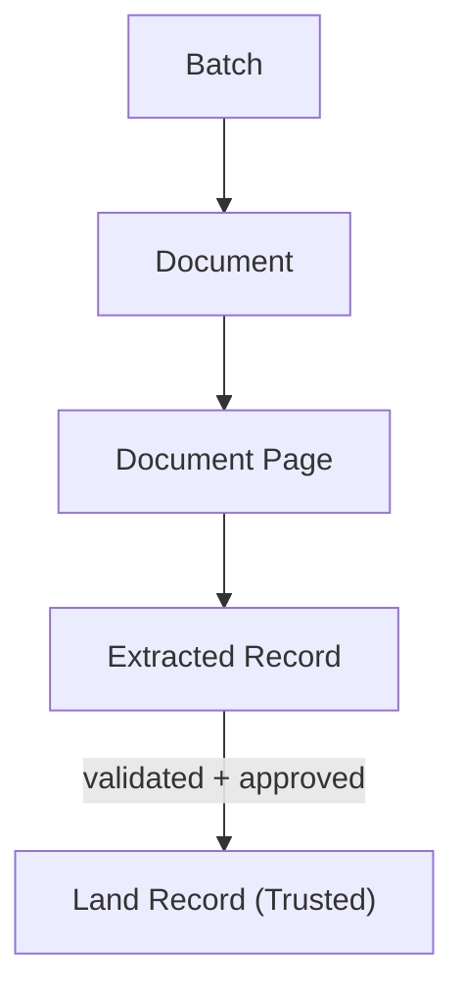
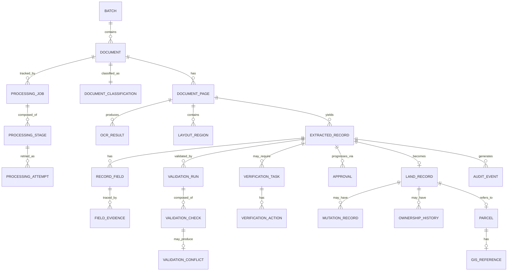

# 02 — Domain Model

> Related: [01-PRODUCT-REQUIREMENTS](./01-PRODUCT-REQUIREMENTS.md) · [05-DATABASE-DESIGN](./05-DATABASE-DESIGN.md) · [03-WORKFLOW-AND-STATE-MACHINE](./03-WORKFLOW-AND-STATE-MACHINE.md)
> Traces: REQ-DOC-002, REQ-REC-001

## 1. Purpose

Defines the canonical domain vocabulary for LANDLENS. **Every other document in this set uses these terms exactly as defined here.** If a later document needs a new concept, this file must be updated first (per the project's consistency requirement).

## 2. Core Principle: Document ≠ Record

The single most important modeling decision in LANDLENS (**D-002**, see [DECISIONS](./DECISIONS.md)):

> A **Document** is the uploaded artifact. An **Extracted Record** is a logical land record discovered inside it. These are never the same database entity, because one document can contain many records (e.g. a register page with 12 khata entries) and, more rarely, one record's evidence could span multiple pages.

## 3. Canonical Terms (use these exact terms everywhere)

| Term | Definition |
|---|---|
| **Batch** | A group of one or more Documents submitted together by an officer for processing. Unit of bulk operation and progress reporting. |
| **Document** | A single uploaded source artifact (one PDF, one image file). Immutable once uploaded; always preserved. |
| **Document Page** | One page within a Document (a single-page image document has exactly one page). |
| **Document Classification** | The AI's determination of a Document's type, language/script, and structural properties (handwriting present, tables present, maps present, multi-record likely). |
| **Processing Job** | The asynchronous unit of work that carries a Document through the pipeline stages. |
| **Processing Stage** | One named step of the pipeline (e.g. OCR, Extraction, Validation) with its own status. |
| **Processing Attempt** | One try at a Processing Stage; retries create new attempts, not overwritten ones. |
| **OCR Result** | Recognized text plus bounding boxes and confidence for a region of a Document Page. |
| **Layout Region** | A detected structural region on a page (table cell, paragraph block, stamp, signature, map area). |
| **Extracted Record** | A logical land record instance identified within one or more Document Pages, before validation/approval. Holds Record Fields. |
| **Record Field** | A single named data point within an Extracted Record (e.g. `ownerName`, `surveyNumber`), carrying original value, normalized value, language, confidence, and evidence. |
| **Field Evidence** | The link from a Record Field back to its source: document, page, bounding box, OCR result. |
| **Validation Run** | One execution of the validation engine against an Extracted Record. |
| **Validation Check** | One rule/comparison executed during a Validation Run, with a structured result (status, severity, expected/actual, source, reason, confidence). |
| **Validation Conflict** | A Validation Check result indicating a mismatch requiring attention. |
| **Verification Task** | A unit of human review work created when a record needs human attention. Assigned to a Verification Officer (or escalated to a Senior Officer). |
| **Verification Action** | A single action taken on a Verification Task: accept / correct / reject / request reprocessing / escalate. |
| **Approval** | A decision event (automatic or human) that moves an Extracted Record toward becoming a Land Record, at a given approval level. |
| **Land Record** (a.k.a. **Trusted Land Record**) | The validated, approved, structured representation of a land record maintained by LANDLENS. Not itself claimed as the legally authoritative government record. |
| **Ownership History / Mutation Record / Registration Record** | Sub-representations of a Land Record's lifecycle events, where the source documents describe them. |
| **Parcel / Survey** | The spatial/administrative unit a Land Record refers to (survey number, khasra/khata linkage), optionally tied to GIS geometry. |
| **GIS Reference** | The link between a Parcel/Survey and its cadastral geometry, where available. |
| **Reference Data Source** | An external/master dataset used for validation (village/tehsil/district masters, cadastral data, prior land records) — real or, during the prototype, synthetic. |
| **Audit Event** | An immutable log entry recording a state-changing action anywhere in the system. |
| **Model Version** | A versioned AI/ML model or prompt/config used at some pipeline stage, tracked for evaluation and rollback. |
| **Evaluation Dataset (Golden Set)** | A curated, ground-truth-labeled dataset used to measure extraction/validation accuracy. |
| **Training Feedback** | A human correction retained as feedback data for future model evaluation/training (never applied directly to a live model). |

## 4. Entity Relationship Overview

## 5. Terminology Not Used (avoid these)

To keep documentation consistent, avoid ambiguous synonyms:
- Don't say "case" or "file" for Document — the existing prototype's Zustand store uses `currentCase`; that term is prototype-only and is **not** carried into this design.
- Don't say "submission" for Batch.
- Don't say "entry" for Record Field.
- Don't conflate "Verified Digital Record" (a phrase from the SIH source text) with **Land Record** — this document set treats them as the same concept and standardizes on **Land Record**.

## 6. Design Decisions Embedded in This Model

- **[LLD]** Document, Page, Extracted Record, and Land Record are four distinct entities (never collapsed) — see REQ-REC-001.
- **[LLD]** A Record Field always retains `originalValue`, `normalizedValue`, AI value, human-corrected value, and final value separately — never overwritten in place (see §29 of the source prompt; detailed in [05-DATABASE-DESIGN](./05-DATABASE-DESIGN.md)).
- **[LLD]** Extraction confidence (on Record Field) and validation/trust confidence (on Validation Check) are modeled as separate concepts, never merged into one score.

## 7. Open Questions

- Whether "Parcel" and "Survey" should be one entity or two in cases where survey-number subdivisions (sub-survey/gat numbers) don't map 1:1 to cadastral parcels — flagged as an open question pending real cadastral data structure (not specified by SIH docs).
- Exact legal/administrative distinction between Mutation Record and Registration Record for Maharashtra 7/12-style documents — requires domain/government clarification.
