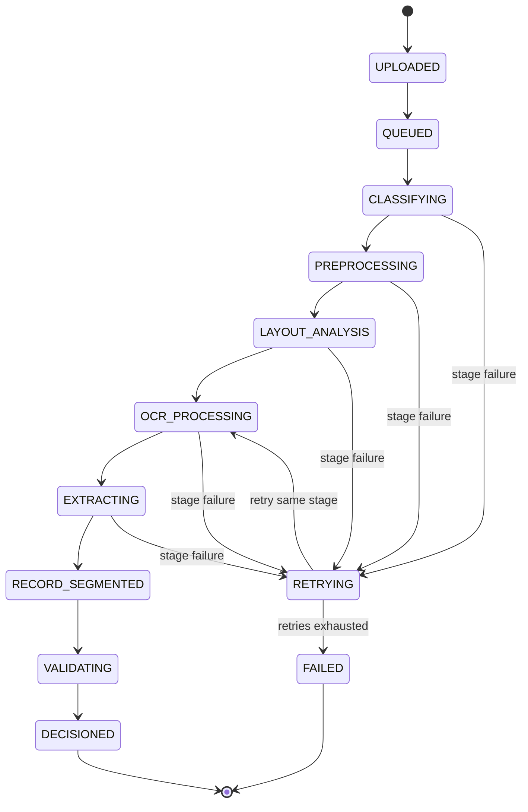
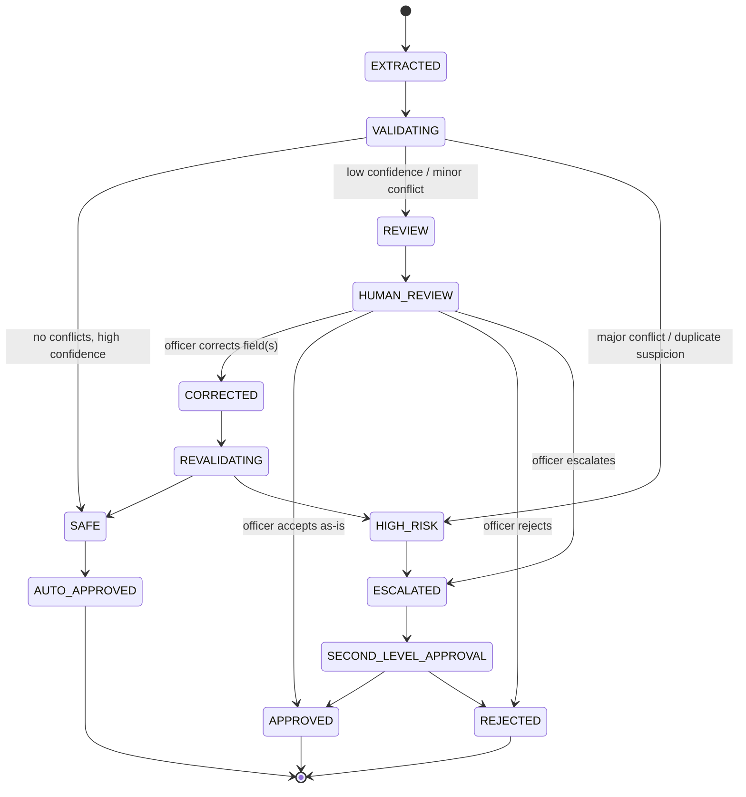
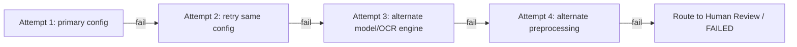

# 03 — Workflow and State Machine

> Related: [02-DOMAIN-MODEL](./02-DOMAIN-MODEL.md) · [06-AI-PROCESSING-PIPELINE](./06-AI-PROCESSING-PIPELINE.md) · [09-HUMAN-VERIFICATION](./09-HUMAN-VERIFICATION.md)
> Traces: REQ-AI-001, REQ-AI-002, REQ-AI-003, REQ-HUMAN-001, REQ-HUMAN-003

## 1. Purpose

Defines the explicit processing states a Document (and, within it, each Extracted Record) moves through, including failure/retry/escalation paths. This is the authoritative state machine — the AI pipeline document and human verification document both implement it, they don't redefine it.

## 2. Document-Level Processing States

Each state above is recorded per-Document (and, where relevant, per-Document-Page) as a **Processing Stage** with its own status — never as one monolithic job status. This directly implements REQ-AI-002 (resumability): if `OCR_PROCESSING` fails, LANDLENS resumes at `OCR_PROCESSING`, not `UPLOADED`.

## 3. Record-Level Decision & Approval States

Once an Extracted Record exists and has a Validation Run, it enters its own state machine:

This is the **risk-based approval model** (see [08-VALIDATION-AND-TRUST-ENGINE](./08-VALIDATION-AND-TRUST-ENGINE.md) and [09-HUMAN-VERIFICATION](./09-HUMAN-VERIFICATION.md)) — a **[LLD]** proposal, not an official government hierarchy (REQ-HUMAN-003).

## 4. Retry Semantics (REQ-AI-003)

Retries are **stage-aware and escalating**, not identical repeats:

Each attempt is stored as a distinct **Processing Attempt** row (never overwriting the prior attempt), carrying: attempt number, stage, configuration used, start/end time, failure reason/category, and outcome. A configurable maximum attempt count per stage determines when a stage moves to `FAILED` and routes for manual intervention rather than retrying indefinitely.

## 5. Idempotency

- Re-submitting the same Batch/Document for processing must not create duplicate Processing Jobs for stages already completed successfully — the system checks existing stage status first (this is what "resume, don't restart" means operationally).
- Each Processing Attempt is idempotent by design: re-running a stage with the same inputs and configuration should be safe to execute more than once (important for retry logic and for officer-triggered manual "Retry" actions).

## 6. Failure / Dead-Letter Handling

A Document/Record that exhausts retries at a stage moves to a `FAILED` (or stage-specific `NEEDS_MANUAL_INTERVENTION`) state rather than silently disappearing or falling back to fake data (REQ tied to §36 of the source prompt — see [13-UI-UX-SPECIFICATION](./13-UI-UX-SPECIFICATION.md) "Error Handling"). Failed items remain visible in batch dashboards with a clear reason and explicit officer actions (Retry / Try alternate engine / Send for manual review).

## 7. Edge Cases

| Case | Handling |
|---|---|
| A Document yields zero Extracted Records (e.g. blank/irrelevant page) | Document completes processing with `RECORD_SEGMENTED` containing zero records; explicitly shown as "no records detected," not treated as a failure. |
| A single Extracted Record's evidence spans two Document Pages | Record Segmentation links Field Evidence across the relevant pages; the record is not artificially split. |
| Officer re-uploads a batch after partial failure | System matches already-processed Documents by content/identity where possible and resumes only unfinished stages (exact de-duplication strategy is an [LLD] proposal — see Open Questions). |
| A record is corrected and revalidation produces a *new* conflict | Re-enters `REVALIDATING → HIGH_RISK` rather than auto-approving just because a human touched it. |

## 8. Prototype vs Production

- **Prototype:** stage transitions may be driven by a simple polling loop against an in-memory or lightly persisted job store (as the current prototype does via `backend/app/core/jobs.py`), acceptable as a starting point but not resumable across restarts until persisted (see REQ-AI-002 gap noted in the codebase audit).
- **Production:** stage state must be persisted transactionally (see [05-DATABASE-DESIGN](./05-DATABASE-DESIGN.md)) and driven by a durable job queue (see [10-SYSTEM-ARCHITECTURE](./10-SYSTEM-ARCHITECTURE.md)).

## 9. Open Questions

- Exact de-duplication strategy for re-uploaded documents (content hash vs. officer-confirmed match) — not specified by SIH docs; proposed default is content-hash matching with officer override.
- Exact maximum retry counts and backoff intervals per stage — to be tuned empirically; proposed defaults documented in [06-AI-PROCESSING-PIPELINE](./06-AI-PROCESSING-PIPELINE.md).
