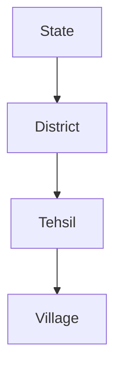

# 04 — Roles and RBAC

> Related: [16-SECURITY](./16-SECURITY.md) · [09-HUMAN-VERIFICATION](./09-HUMAN-VERIFICATION.md) · [05-DATABASE-DESIGN](./05-DATABASE-DESIGN.md)
> Traces: REQ-RBAC-001, REQ-SEC-001

## 1. Purpose

Defines LANDLENS's proposed role model and access-control approach. **These roles are LANDLENS design proposals ([LLD]), not an official government organizational hierarchy** — the SIH problem statement does not specify job titles, so all designations here are configurable placeholders (per source prompt §26).

## 2. Access Model

```
Access = Role + Organizational Scope + Action Permission
```

- **Role** — the officer's functional capability (what actions they can perform).
- **Organizational Scope** — the geographic/administrative boundary of data they can see: `State → District → Tehsil → Village`. Not every officer sees all government data; scope narrows visibility.
- **Action Permission** — the specific fine-grained operation (upload, retry, correct-field, approve, second-level-approve, view-audit, manage-users, etc.), attachable per role but overridable per user where needed.

This three-part model is deliberately more granular than a flat role list so that future geographic/departmental scoping (REQ-RBAC-001) doesn't require a redesign.

## 3. Proposed Roles

| Role | Primary Responsibilities | Typical Permissions |
|---|---|---|
| **Digitization Officer / Operator** | Create batches, upload documents, monitor processing, retry failures. | Create batch, upload, view own-scope batches/documents, trigger retry, view records within scope. |
| **Verification Officer** | Review exception records (REVIEW state), inspect evidence, correct fields, approve/reject/escalate. | View/correct Extracted Records in queue, create Verification Actions, approve at first level, escalate. |
| **Senior / Supervisory Officer** | Second-level approval for HIGH_RISK/escalated records, department performance oversight. | Approve/reject escalated records, view department analytics, cannot casually edit records outside escalation flow. |
| **Auditor** | Inspect records and audit trails; oversight only. | Read-only access to Audit Events, records, approvals across permitted scope. Cannot modify records. |
| **System Administrator** | User/role management, system configuration, integration management. | Manage users/roles/scopes, configure validation rules and thresholds, manage connectors, no default access to record content beyond what's needed for support. |

Additional roles (e.g. a read-only "Citizen Services" viewer, or a "Data Steward" for reference datasets) are anticipated as **[FUTURE]** extensions and should slot into the same Role+Scope+Permission model without redesign.

## 4. Permission Matrix (Illustrative)

| Action | Operator | Verification Officer | Senior Officer | Auditor | Admin |
|---|:---:|:---:|:---:|:---:|:---:|
| Create/upload batch | ✅ | — | — | — | — |
| Retry failed stage | ✅ | — | — | — | ✅ |
| View records (in scope) | ✅ | ✅ | ✅ | ✅ | ✅ |
| Correct a field | — | ✅ | ✅ | — | — |
| First-level approve | — | ✅ | ✅ | — | — |
| Second-level approve | — | — | ✅ | — | — |
| View audit trail | — | ✅ (own actions) | ✅ | ✅ (full) | ✅ |
| Manage users/roles | — | — | — | — | ✅ |
| Configure validation rules | — | — | — | — | ✅ |
| Export/sync to government systems | — | — | ✅ (or Admin) | — | ✅ |

Exact cell values are a proposed starting matrix, configurable by an Administrator — not a fixed government mandate.

## 5. Organizational Scope Model



**[LLD]** A user's scope assignment (e.g. "Tehsil X within District Y") filters which Batches, Documents, and Land Records they can see and act on, in addition to their Role's action permissions. The prototype may implement a simplified single-scope model (e.g. one district) with the full hierarchy designed but not fully populated (REQ tied to REQ-RBAC-001).

## 6. Design Principles

- **[LLD]** Do not assume unrestricted access for any role by default — scope is always applied, even for Administrators viewing record content (administrative actions like user management are scope-independent; record content access is not).
- **[LLD]** Auditors have read-only access by design — auditing a system that can also modify it undermines the audit function.
- **[LLD]** Senior Officers should not "casually modify" records outside the escalation flow (per source prompt §26) — their edit rights are scoped to the approval decision itself, not free-form field editing.

## 7. Authentication

See [16-SECURITY](./16-SECURITY.md) for authentication mechanism detail. In summary: the prototype may use simplified authentication (e.g. a basic login), while production requires a robust identity provider integration — **[FUTURE]**, since government SSO/identity infrastructure is not assumed available during SIH development.

## 8. Prototype vs Production

| | Prototype | Production |
|---|---|---|
| Auth | Simplified login, few seeded accounts | Full identity provider integration (possibly government SSO) |
| Scope | May be flattened to one district/prototype dataset | Full State→Village hierarchy populated from authoritative org data |
| Role management | Admin-seeded, minimal self-service UI | Full self-service admin console with approval workflow for new accounts |

## 9. Open Questions

- Official government job titles/designations for each functional role (e.g. what a "Verification Officer" is actually called in a given state's revenue department) — requires government clarification; LANDLENS uses functional names deliberately.
- Whether Second-Level Approval authority should be tied to organizational scope, role, or both — currently modeled as both (a Senior Officer approves within their scope).
- Exact legal delegation rules for approval authority — outside LANDLENS's ability to determine without government input.
