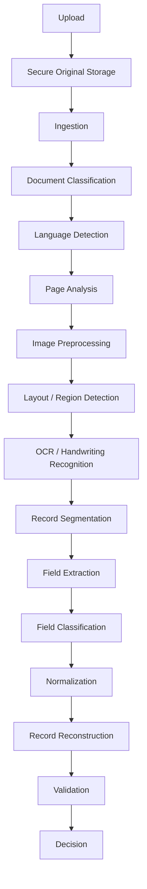

# 06 — AI Processing Pipeline

> Related: [07-OCR-AND-DOCUMENT-UNDERSTANDING](./07-OCR-AND-DOCUMENT-UNDERSTANDING.md) · [03-WORKFLOW-AND-STATE-MACHINE](./03-WORKFLOW-AND-STATE-MACHINE.md) · [08-VALIDATION-AND-TRUST-ENGINE](./08-VALIDATION-AND-TRUST-ENGINE.md)
> Traces: REQ-AI-001 – REQ-AI-007, REQ-DOC-004, REQ-DOC-005

## 1. Purpose

Defines the end-to-end automated processing pipeline: stages, inputs/outputs, model responsibilities, and fallback behavior. This is the "what happens after upload" document.

## 2. Pipeline Stages



Each box is a **Processing Stage** in the sense defined by [03-WORKFLOW-AND-STATE-MACHINE](./03-WORKFLOW-AND-STATE-MACHINE.md) — independently retryable, independently observable.

## 3. Stage Detail

| Stage | Input | Output | Notes |
|---|---|---|---|
| Secure Original Storage | Raw upload bytes | Stored, checksummed original | Never mutated afterward (REQ-DOC-003). |
| Document Classification | Original document | `DocumentClassification` (type, language, handwriting/table/map flags, multi-record likelihood) | Officer does not pre-classify (REQ-DOC-004). Model must be swappable (REQ-AI-007). |
| Language Detection | Page images/text | Detected language(s)/script per page/region | Feeds OCR engine selection. |
| Page Analysis | Document pages | Per-page structural notes (orientation, quality flags) | Detects skew, blur, damage for preprocessing routing. |
| Image Preprocessing | Page image | Cleaned image (deskew, denoise, contrast) | OpenCV-based; parameters may vary by detected quality issue. |
| Layout / Region Detection | Preprocessed image | LayoutRegions (tables, paragraphs, stamps, signatures) | Determines what gets OCR'd how (table-aware vs free text). |
| OCR / Handwriting Recognition | Regions + image | OCRResults (text, bbox, confidence) | See [07-OCR-AND-DOCUMENT-UNDERSTANDING](./07-OCR-AND-DOCUMENT-UNDERSTANDING.md) for the ensemble approach. |
| Record Segmentation | OCR results + layout | One or more candidate ExtractedRecord boundaries | Implements REQ-DOC-002 — a document is not assumed to be one record. |
| Field Extraction | Segmented record + OCR text | Raw field values with evidence links | Schema-driven per document type (REQ-AI-005). |
| Field Classification | Raw extracted text | Mapped to canonical field names | E.g. distinguishing "khata number" text from "survey number" text when layout is ambiguous. |
| Normalization | Raw field values | Normalized values (numbers, dates, standardized names) alongside originals | REQ-AI-006: original preserved, never discarded. |
| Record Reconstruction | Normalized fields | Assembled ExtractedRecord | Combines fields possibly spanning multiple layout regions/pages. |
| Validation | ExtractedRecord | ValidationRun + Checks | See [08-VALIDATION-AND-TRUST-ENGINE](./08-VALIDATION-AND-TRUST-ENGINE.md). |
| Decision | Validation result | SAFE / REVIEW / HIGH_RISK routing | See [03-WORKFLOW-AND-STATE-MACHINE](./03-WORKFLOW-AND-STATE-MACHINE.md) §3. |

## 4. Field Schema Extensibility (REQ-AI-005)


**[LLD]** Field schemas are keyed by Document Type and stored as configuration, not hard-coded per field. The initial schema (informed by the SIH documentation and current prototype) includes: owner name, survey number, khasra number, khata number, plot area, village, tehsil, district, land classification, ownership details, mutation records, registration information — but the architecture must support adding new document types with different field sets without code changes to the extraction stage itself.

## 5. Multilingual Field Model (REQ-AI-006)

Each Record Field conceptually carries:

```text
originalValue        — as read from the source script/language
normalizedValue       — standardized, searchable representation
language              — detected language/script
transliteration       — where applicable
confidence            — extraction confidence
sourceDocument, page, boundingBox — evidence
```

This is especially critical for landowner names in historical Marathi/Devanagari or other regional-script records, where transliteration variance is common and the original must remain the reference of truth.

## 6. Model Replaceability (REQ-AI-007)

**[LLD]** Every AI-backed stage (classification, OCR, extraction) is called through an abstraction that records which `ModelVersion` produced a given result. This allows:
- Swapping providers (the current prototype already does this for VLM providers: Gemini primary, Sarvam/Groq/OpenRouter/HF as fallback) without touching downstream stages.
- Comparing model versions against the golden evaluation dataset before promoting a new version to production (see [18-AI-EVALUATION-AND-CONTINUOUS-LEARNING](./18-AI-EVALUATION-AND-CONTINUOUS-LEARNING.md)).

## 7. Intelligent Retry / Fallback (REQ-AI-003)


**[LLD]** The exact ensemble (e.g. Tesseract + cloud VLM + handwriting-specific model) is a design choice, not an SIH mandate. What is required is that a failed stage has *controlled, escalating* retry/fallback behavior rather than either infinite identical retries or an immediate silent fallback to fabricated data.

## 8. Asynchrony (REQ-AI-001)

Processing must not require the officer's browser session to remain open. **[LLD]** This implies a durable background job system (see [10-SYSTEM-ARCHITECTURE](./10-SYSTEM-ARCHITECTURE.md)) with persisted per-stage status (see [05-DATABASE-DESIGN](./05-DATABASE-DESIGN.md)), polled or pushed to the UI for live status.

## 9. Prototype vs Production

| | Prototype | Production |
|---|---|---|
| OCR/Extraction | Cloud VLM (e.g. Gemini) primary + Tesseract/browser fallback, as in the current codebase | Full OCR ensemble (printed + handwriting-specific models), on-prem or hybrid deployment options for sensitive data |
| Job execution | May run inline/background task in the API process | Dedicated worker pool behind a durable queue |
| Model set | Limited coverage, may lean on general-purpose VLMs | Domain-tuned models per document type, evaluated against golden set |

## 10. Open Questions

- Exact set of Indian languages/scripts to guarantee coverage for at prototype stage vs. full production (not specified by SIH docs beyond "multilingual").
- Whether Field Classification should be a distinct stage or merged into Field Extraction for the prototype — kept separate here for clarity and future flexibility; may be collapsed in an MVP implementation.
