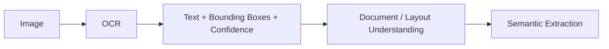

# 07 — OCR and Document Understanding

> Related: [06-AI-PROCESSING-PIPELINE](./06-AI-PROCESSING-PIPELINE.md) · [13-UI-UX-SPECIFICATION](./13-UI-UX-SPECIFICATION.md) (verification evidence view)
> Traces: REQ-AI-004, REQ-VAL-001

## 1. Purpose

Defines how LANDLENS treats OCR as one stage of *document understanding*, not the final extraction system, and what evidence must be preserved from it.

## 2. Core Principle: OCR Is Not Extraction

**[SIH]/[LLD]** Reading characters correctly (OCR) is necessary but not sufficient for producing a correct land record — text must still be located within document structure (which cell of which table, which stamp block) and interpreted semantically (this text is a survey number vs. a date). Treating raw OCR output as the final answer is explicitly disallowed (source prompt §45: "assume OCR alone solves extraction").

## 3. Required Recognition Capabilities (REQ-AI-004)

The system must support:
- Printed text
- Handwritten text
- Multilingual text (major Indian languages/scripts)
- Degraded scans (faded, low contrast)
- Damaged pages (torn, stained, partially missing)
- Inconsistent layouts across document eras/formats
- Tables (structured row/column data)
- Handwritten annotations/marginalia layered on printed forms

## 4. Evidence Preserved Per OCR Result

For every recognized text region, the architecture preserves:

| Field | Purpose |
|---|---|
| Original image / document reference | Ground truth to re-verify against |
| OCR text | The raw recognized string |
| OCR confidence | Model's own certainty |
| Bounding box | Where on the page, for hover/crop display during verification |
| Page number | Locates the region within a multi-page document |
| Source region | Links to the LayoutRegion (e.g. "table cell row 4 col 2") |
| Language | Detected script/language of the region |
| Extraction confidence (downstream) | Distinct from OCR confidence — set once semantic extraction interprets the text (see [08-VALIDATION-AND-TRUST-ENGINE](./08-VALIDATION-AND-TRUST-ENGINE.md) for how this differs from *trust*) |

This evidence set is what powers the human verification screen's "show the crop next to the value" UX (REQ-HUMAN-002).

## 5. Document Understanding Beyond OCR

Layout/region detection determines document structure before or alongside OCR:
- Table detection (rows/columns of a register)
- Stamp/signature detection (relevant for authenticity notes, not itself a data field but useful metadata)
- Map/diagram region detection (routed differently — may feed [14-GIS-AND-CADASTRAL-DESIGN](./14-GIS-AND-CADASTRAL-DESIGN.md) rather than OCR)
- Multi-record boundary detection within a page (feeds Record Segmentation in the pipeline)

## 6. Ensemble Approach (Illustrative, Not Mandated)

**[LLD]** The current prototype uses a cloud VLM (vision-language model) as primary extraction with a browser-side Tesseract.js fallback. This is one valid approach. The architectural requirement is only that:
1. The OCR/understanding stage is swappable (REQ-AI-007), and
2. Confidence and evidence are always captured regardless of which engine produced the result.

A production ensemble might combine a general OCR engine (printed text), a handwriting-specialized model, and a layout-aware model (e.g. table/structure detection) — but the exact composition is an implementation decision, not specified by the SIH problem statement.

## 7. Failure Modes Specific to OCR

| Failure | Handling |
|---|---|
| Illegible handwriting (even to a human at low resolution) | Low OCR confidence propagates to low extraction confidence → routes to human review with full-resolution crop, not silently guessed. |
| Mixed-script line (e.g. Devanagari + Latin numerals) | Region-level language detection avoids forcing one script model on the whole page. |
| Physical damage obscuring part of a field | Field marked with an explicit "illegible/damaged" flag rather than an empty or fabricated value. |
| Stamp/seal overlapping text | Layout detection should isolate the stamp as its own region so it doesn't corrupt adjacent text OCR. |

## 8. Prototype vs Production

- **Prototype:** may rely primarily on a general-purpose cloud VLM for both layout understanding and text recognition in one call, with a simple rules-based fallback (as in `backend/app/services/extraction/rules.py` in the current codebase).
- **Production:** dedicated layout detection (e.g. table/region models) feeding a separate OCR/handwriting recognition step, enabling independent tuning and evaluation of each.

## 9. Open Questions

- Whether handwriting recognition accuracy for 1960s-era Marathi registers is sufficient with current general-purpose models, or requires a fine-tuned model — this is an empirical question to be answered via the golden dataset evaluation (see [18-AI-EVALUATION-AND-CONTINUOUS-LEARNING](./18-AI-EVALUATION-AND-CONTINUOUS-LEARNING.md)), not assumed here.
