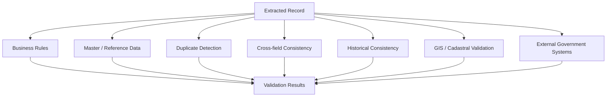
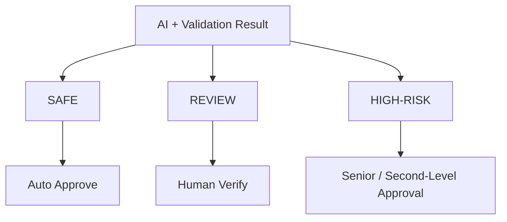
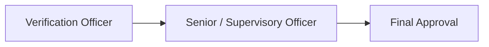

# 08 — Validation and Trust Engine

> Related: [06-AI-PROCESSING-PIPELINE](./06-AI-PROCESSING-PIPELINE.md) · [09-HUMAN-VERIFICATION](./09-HUMAN-VERIFICATION.md) · [03-WORKFLOW-AND-STATE-MACHINE](./03-WORKFLOW-AND-STATE-MACHINE.md)
> Traces: REQ-VAL-001 – REQ-VAL-005, REQ-HUMAN-003

## 1. Purpose

Defines the confidence model and the modular validation engine that together decide whether an Extracted Record can be auto-approved, needs human review, or needs second-level approval.

## 2. Two Distinct Confidence Concepts (REQ-VAL-001)

**[SIH]/[LLD]** This is the single most important idea in this document, and it must not be collapsed into one score:

| Concept | Question it answers | Set by |
|---|---|---|
| **Extraction confidence** | How confident is the AI/OCR that it *read* the value correctly? | OCR/extraction stage |
| **Validation / trust confidence** | How *consistent* is the value with authoritative/reference information and other evidence? | Validation engine |

Example (from source prompt §13):

```text
Survey Number
AI confidence:        99%
Database consistency: conflict
Trust:                LOW
```

**High extraction confidence ≠ automatically trustworthy record** (REQ-VAL-005). A record can be read perfectly and still be wrong relative to the authoritative source, or vice versa.

## 3. Validation Engine Architecture (REQ-VAL-002, REQ-VAL-003)



**[LLD]** Each check is a modular, independently addable unit (REQ-VAL-003) — new checks (e.g. a new business rule, a new reference source) should not require redesigning the engine. Each `ValidationCheck` returns a structured result:

```text
check           — which rule/comparison ran
status          — pass / fail / warning / inconclusive
severity        — informational / minor / major / critical
expectedValue   — what the reference/rule expected
actualValue     — what was extracted
source          — which reference/rule produced this
reason          — human-readable explanation
confidence      — the check's own confidence in its result
```

## 4. Check Categories

| Category | Example | Notes |
|---|---|---|
| Business rules | "Plot area must be > 0"; "khata number format matches expected pattern" | Simple, deterministic, defined by LANDLENS — **not** claimed as official government rules unless explicitly sourced (§14 of source prompt). |
| Master/reference data | Village/tehsil/district name exists in master list | Depends on `ReferenceDataSource`; flagged synthetic in the prototype (see [05-DATABASE-DESIGN](./05-DATABASE-DESIGN.md) §4). |
| Duplicate detection | Same survey number + owner already exists as an approved Land Record | Fuzzy matching on names, exact on structured identifiers where possible. |
| Cross-field consistency | Area stated in text matches area implied by other fields on the same document | Catches internal contradictions within one record. |
| Historical consistency | New mutation record's prior-owner matches last known owner in Ownership History | Requires access to prior Land Records. |
| GIS/cadastral validation | Survey number's implied location falls within expected village boundary | See [14-GIS-AND-CADASTRAL-DESIGN](./14-GIS-AND-CADASTRAL-DESIGN.md); depends on geometry availability. |
| External government systems | Cross-check against live LRMS/DILRMP | **[FUTURE]** — not assumed available during SIH development (REQ-API-001). |

## 5. Risk-Based Decision Model (REQ-HUMAN-003)



| Tier | Example triggers |
|---|---|
| **SAFE** | High extraction confidence, no validation conflicts, no duplicate concerns, cross-field consistent, acceptable reference-data match. |
| **REVIEW** | Low-confidence field, ambiguous OCR, handwriting uncertainty, minor mismatch, possible (not certain) duplicate. |
| **HIGH-RISK** | Major ownership conflict, significant area mismatch, authoritative database conflict, serious mutation inconsistency, significant GIS/cadastral conflict, suspicious duplicate. |

**[LLD]** These tiers and their trigger conditions are a LANDLENS design proposal, not a claim about official government risk policy (source prompt §17).

## 6. Second-Level Approval (REQ-HUMAN-003, links to [04-ROLES-AND-RBAC](./04-ROLES-AND-RBAC.md))



HIGH-RISK records escalate through a second human tier before approval. Government designations for this tier are configurable, not hard-coded (avoid assuming e.g. "Tehsildar" without source justification).

## 7. Prototype vs Production

- **Prototype:** business rules and cross-field checks are fully implementable now; master/reference data and GIS checks likely run against synthetic/sample datasets, clearly labeled as such; external government system checks are stubbed/mocked, never presented as live.
- **Production:** master data and GIS checks run against real authoritative sources where integration is granted; external system checks become live via the connector layer ([11-API-AND-GOVERNMENT-INTEGRATION](./11-API-AND-GOVERNMENT-INTEGRATION.md)).

## 8. Open Questions

- Official validation rule definitions (exact business rules used by revenue departments) — not specified by SIH docs; the checks listed above are illustrative LANDLENS proposals, explicitly not asserted as official rules (source prompt §14).
- Exact numeric thresholds separating SAFE/REVIEW/HIGH-RISK — proposed as tunable configuration rather than fixed constants; specific starting values should be validated against the golden dataset (see [18-AI-EVALUATION-AND-CONTINUOUS-LEARNING](./18-AI-EVALUATION-AND-CONTINUOUS-LEARNING.md)) rather than asserted here.
