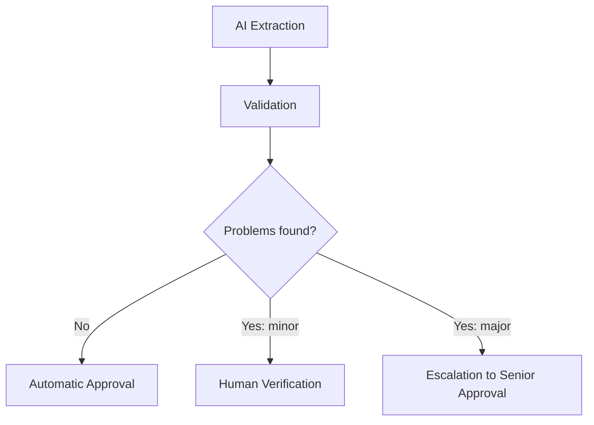

# 09 — Human Verification

> Related: [08-VALIDATION-AND-TRUST-ENGINE](./08-VALIDATION-AND-TRUST-ENGINE.md) · [04-ROLES-AND-RBAC](./04-ROLES-AND-RBAC.md) · [13-UI-UX-SPECIFICATION](./13-UI-UX-SPECIFICATION.md) · [15-AUDIT-AND-PROVENANCE](./15-AUDIT-AND-PROVENANCE.md)
> Traces: REQ-HUMAN-001 – REQ-HUMAN-004

## 1. Purpose

Defines how, when, and by whom human review happens, and exactly what a Verification Officer sees and can do. This is the human-in-the-loop counterpart to [08-VALIDATION-AND-TRUST-ENGINE](./08-VALIDATION-AND-TRUST-ENGINE.md).

## 2. Guiding Principle (REQ-HUMAN-001)

> Human intervention only when the automated system identifies uncertainty, conflict, or risk — never as a blanket 100%-manual-check requirement.



Requiring manual verification of every record would eliminate much of the value of automation (this is decision **D-004**, see [DECISIONS](./DECISIONS.md)).

## 3. The Verification Task

A **Verification Task** (see [02-DOMAIN-MODEL](./02-DOMAIN-MODEL.md)) is created whenever a Validation Run routes a record to REVIEW or HIGH_RISK. It carries:
- The triggering reason(s) (which check(s) failed, at what severity)
- The assigned officer (based on role + scope, or escalation target)
- Priority (e.g. HIGH_RISK tasks may be prioritized over routine REVIEW tasks)

## 4. Verification Screen Contents (REQ-HUMAN-002)

The verification UI must show, together, not as a giant re-entry form:

```text
Original document (source evidence, zoomable)
+ relevant image crop (bounding box of the field in question)
+ extracted value (AI's answer)
+ extraction confidence
+ validation result (what conflicted, with what source)
+ conflicting value/source (the reference data or rule that disagreed)
+ reason for review
+ proposed correction field (officer edits here)
```

This directly implements the UI/UX principle from source prompt §16 and §35: **evidence-based verification, not blind data re-entry.**

## 5. Officer Actions (Verification Action types)

| Action | Effect |
|---|---|
| **Accept** | AI value confirmed correct as-is; record proceeds toward approval. |
| **Correct** | Officer supplies a new value for one or more fields; original AI value is retained (REQ-HUMAN-004), record moves to `CORRECTED → REVALIDATING`. |
| **Reject** | Record marked rejected with reason; does not become a Land Record. |
| **Request reprocessing** | Sends the record (or its source document/page) back into the AI pipeline — e.g. if the officer suspects a different OCR pass would help — rather than forcing manual full transcription. |
| **Escalate** | Routes to Senior/Supervisory Officer for second-level approval (used both for officer-initiated escalation and automatic HIGH-RISK routing). |

## 6. Correction Provenance (REQ-HUMAN-004, links to D-006)

```text
Field: ownerName
AI:      "Ram Patil"      confidence: 0.84
Human:   "Ramesh Patil"
Final:   "Ramesh Patil"
Evidence: document/page/bounding box
Correction: who + when + reason
```

**[SIH]/[LLD]** The AI's original output is never silently overwritten. Both values persist, with full attribution — essential for auditability (see [15-AUDIT-AND-PROVENANCE](./15-AUDIT-AND-PROVENANCE.md)) and for future model evaluation (see [18-AI-EVALUATION-AND-CONTINUOUS-LEARNING](./18-AI-EVALUATION-AND-CONTINUOUS-LEARNING.md)).

## 7. Revalidation After Correction

A corrected record re-enters validation (`REVALIDATING` in the state machine) rather than being auto-approved just because a human touched it. If the correction introduces a *new* conflict, the record can still route to HIGH_RISK — human correction is not treated as automatically authoritative over reference data without passing validation again.

## 8. Escalation and Second-Level Approval

See [08-VALIDATION-AND-TRUST-ENGINE](./08-VALIDATION-AND-TRUST-ENGINE.md) §6 and [04-ROLES-AND-RBAC](./04-ROLES-AND-RBAC.md) for the tiered approval model. A Senior/Supervisory Officer sees the same evidence-based view as a Verification Officer, plus the full history of the first-level review (who looked at it, what they found, why it was escalated).

## 9. Queue Management

Officers work from a persistent queue (**My Queue**, **Escalated**, **Completed** — see [12-INFORMATION-ARCHITECTURE](./12-INFORMATION-ARCHITECTURE.md)), not an ephemeral in-session list. Queue state must survive the officer navigating away and returning, consistent with REQ-ANALYTICS-002's "leave and return" principle applied to individual work queues as well as batch dashboards.

## 10. Prototype vs Production

- **Prototype:** verification and audit endpoints may initially be stubs that echo input without full persistence (as in the current codebase's `verify.py`); this document specifies the target behavior these stubs must grow into — full persistence of Verification Tasks/Actions plus Audit Events.
- **Production:** full queue assignment logic (load balancing across officers, SLA tracking) and possibly notification integration (see analytics/dashboards).

## 11. Open Questions

- Whether reassignment of a Verification Task between officers should be automatic (e.g. on timeout) or manual-only — not specified by SIH docs; proposed as manual/admin-triggered for the prototype.
- Exact escalation SLA expectations (how quickly a HIGH-RISK item must reach a Senior Officer) — requires government/operational input.
