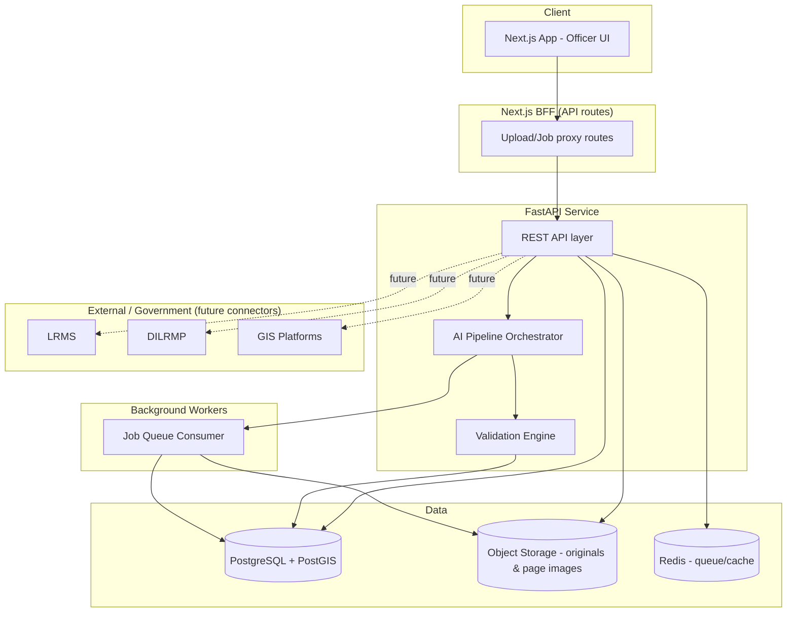
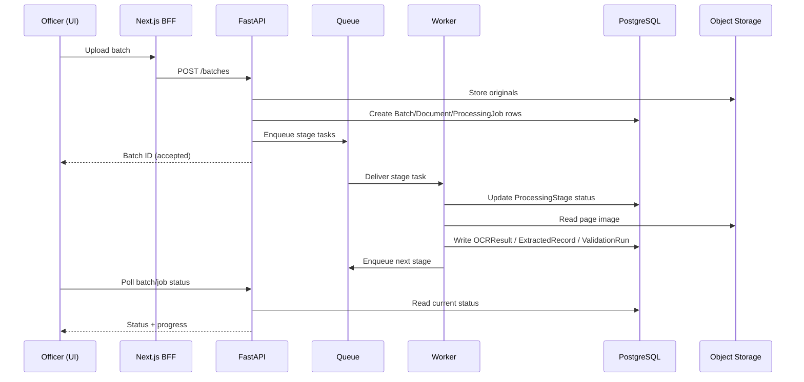

# 10 — System Architecture

> Related: [06-AI-PROCESSING-PIPELINE](./06-AI-PROCESSING-PIPELINE.md) · [05-DATABASE-DESIGN](./05-DATABASE-DESIGN.md) · [11-API-AND-GOVERNMENT-INTEGRATION](./11-API-AND-GOVERNMENT-INTEGRATION.md) · [16-SECURITY](./16-SECURITY.md)
> Traces: REQ-AI-001, REQ-AI-002, REQ-SEC-001

## 1. Purpose

Defines system components and how they communicate — the container-level architecture — building on the existing LANDLENS codebase (Next.js frontend + FastAPI backend) rather than discarding it.

## 2. Component Overview

## 3. Components

| Component | Responsibility | Current codebase basis |
|---|---|---|
| **Officer UI** | Next.js/React app; batch upload, dashboards, verification screens, GIS, analytics, audit views. | `src/app/(app)/*` (10 pages already scaffolded). |
| **BFF (Backend-for-Frontend)** | Thin Next.js API routes proxying to FastAPI; keeps backend URL/config out of the browser. | `src/app/api/upload`, `src/app/api/jobs/[jobId]`. |
| **REST API Layer** | FastAPI; authentication, request validation, orchestration entry points. | `backend/app/api/v1/*`. |
| **AI Pipeline Orchestrator** | Drives a Document through the stages in [06-AI-PROCESSING-PIPELINE](./06-AI-PROCESSING-PIPELINE.md); tracks per-stage state. | `backend/app/services/pipeline.py` (needs persistence + queue backing per REQ-AI-002). |
| **Validation Engine** | Executes modular checks per [08-VALIDATION-AND-TRUST-ENGINE](./08-VALIDATION-AND-TRUST-ENGINE.md). | Currently a stub (`validate.py`) — to be built out. |
| **Background Workers** | Execute long-running/asynchronous pipeline stages off the request thread. | Not yet present; **required** for REQ-AI-001 asynchrony at scale. |
| **PostgreSQL + PostGIS** | System of record for all entities in [05-DATABASE-DESIGN](./05-DATABASE-DESIGN.md); PostGIS for spatial types. | Planned in `backend/PLAN.md`, not yet implemented (currently in-memory). |
| **Object Storage** | Immutable original documents + page images. | Planned (S3/MinIO), not yet implemented. |
| **Redis / Queue** | Job queue backing for asynchronous, resumable processing. | Planned (Celery/Redis in dependency list), not yet wired up. |
| **External Connectors** | LRMS/DILRMP/GIS integration adapters. | Not present; see [11-API-AND-GOVERNMENT-INTEGRATION](./11-API-AND-GOVERNMENT-INTEGRATION.md). |

## 4. Why a Queue Is Required (not optional)

**[LLD]** REQ-AI-001 (asynchronous processing) and REQ-AI-002 (resumability) together require that pipeline execution survive both (a) a slow/long-running stage and (b) an API process restart. An in-process background task (as currently implemented) satisfies neither once batches grow beyond a handful of documents or the API process is redeployed. A durable queue (Redis/Celery, or equivalent) consuming persisted `ProcessingStage` rows is therefore treated as a production requirement, not a nice-to-have — while acceptable as a simplified stand-in during early prototype iterations.

## 5. Data Flow: Upload to Decision

## 6. Environment Separation

**[LLD]** Distinct environments (dev / staging / production) with separate credentials, databases, and — critically — separate reference-data sets (synthetic vs any real data made available) so that prototype/demo data can never be mistaken for or leak into a production dataset.

## 7. Prototype vs Production

| | Prototype | Production |
|---|---|---|
| Job execution | In-process background task acceptable for demo scale | Dedicated worker pool, durable queue |
| Storage | Local disk or single MinIO instance acceptable | Managed object storage with lifecycle policies |
| Database | Single PostgreSQL instance | Managed PostgreSQL with backups, possibly read replicas |
| Auth | Simplified | Full identity provider integration |
| Deployment | Single-host or simple container setup | See [19-DEPLOYMENT-AND-SIH-ROADMAP](./19-DEPLOYMENT-AND-SIH-ROADMAP.md) |

## 8. Open Questions

- Target deployment environment (NIC MeghRaj vs AWS/Azure Government vs generic cloud) — SIH documentation lists all as suggestions, not a mandate; final choice depends on government infrastructure access not available during prototype development.
