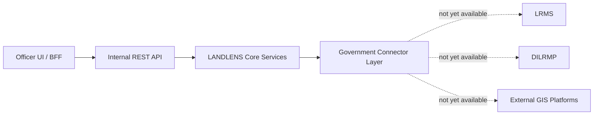
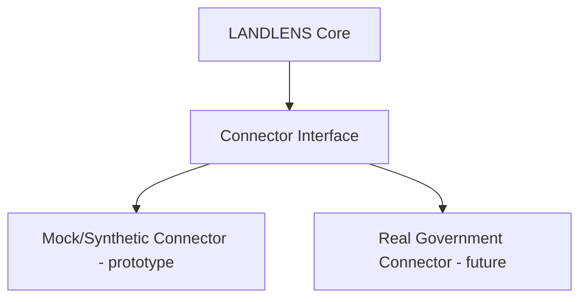

# 11 — API and Government Integration

> Related: [10-SYSTEM-ARCHITECTURE](./10-SYSTEM-ARCHITECTURE.md) · [14-GIS-AND-CADASTRAL-DESIGN](./14-GIS-AND-CADASTRAL-DESIGN.md) · [16-SECURITY](./16-SECURITY.md)
> Traces: REQ-API-001, REQ-API-002

## 1. Purpose

Defines the API surface concept and the connector-based approach to government system integration (LRMS, DILRMP, GIS, other databases), without assuming any specific government API actually exists or is accessible during the SIH prototype.

## 2. API Layers



| Layer | Purpose |
|---|---|
| **Internal REST API** | Consumed by the Officer UI/BFF; batches, documents, records, verification, audit, analytics endpoints. |
| **Connector Layer** | Abstraction that isolates LANDLENS core from the specifics of any one government system's API. Each government integration is a swappable connector implementation. |

## 3. Internal API — Conceptual Endpoint Groups

Endpoint *concepts*, not final route contracts (implementation detail belongs in code, not this document):

| Group | Concept |
|---|---|
| Batches | Create batch, list batches, get batch status/progress |
| Documents | List documents in a batch, get document detail + classification, retry a stage |
| Records | List/search Extracted Records and Land Records, get record detail with field evidence |
| Verification | List queue (mine/escalated/completed), get task detail, submit a Verification Action |
| Approvals | Get approval history for a record, submit second-level decision |
| Audit | Query audit events by entity |
| Analytics | Query dashboard metrics (see [17-ANALYTICS-AND-MONITORING](./17-ANALYTICS-AND-MONITORING.md)) |
| Admin | Manage users/roles/scopes, manage validation rule configuration, manage connectors |

Each endpoint requires authentication and is subject to the RBAC model in [04-ROLES-AND-RBAC](./04-ROLES-AND-RBAC.md).

## 4. Authentication & Errors (concept level)

- **[LLD]** Token-based authentication (e.g. bearer tokens issued at login) for all API calls; the BFF should not expose backend credentials to the browser.
- Errors should be structured and actionable (entity not found, validation failed, permission denied, upstream connector unavailable) — never silently substituted with placeholder/sample data (source prompt §36; see also [13-UI-UX-SPECIFICATION](./13-UI-UX-SPECIFICATION.md) "Error Handling").

## 5. Government Connector Layer (REQ-API-001)



**[LLD]** Every external integration point (LRMS record lookup, DILRMP sync, external GIS/cadastral service, other government databases) is defined behind a common connector interface (e.g. "fetch reference record by survey number," "push approved Land Record," "fetch cadastral geometry"). During the SIH prototype, these interfaces are backed by **mock or synthetic implementations**, clearly labeled as such wherever their data surfaces in the UI (see [05-DATABASE-DESIGN](./05-DATABASE-DESIGN.md) `ReferenceDataSource.is_synthetic`). Real implementations can be swapped in later without changing core validation/approval logic — this is decision **D-007**.

## 6. What Is Explicitly Not Assumed

**[LLD]**, directly from source prompt §20 and §45:
- No assumption that live LRMS or DILRMP APIs exist or are reachable during SIH development.
- No invented government API specifications presented as real.
- No claim that LANDLENS's export/sync automatically updates an official government system — it is designed to support that *when* integration is granted (REQ-API-002), not to assert it already does.

## 7. Export / Sync Model

```text
LANDLENS (approved Land Record)
     │
     ├── Export (file/API pull by an external system)
     ├── Sync (push via connector, when available)
     └── Import (ingest reference data from an external system)
```

**[LLD]** Exports should carry full provenance (who approved, when, based on which source document) so a receiving government system — or an auditor — can trace any exported record back to LANDLENS's evidence chain.

## 8. Prototype vs Production

| | Prototype | Production |
|---|---|---|
| Connectors | Mock/synthetic, clearly labeled | Real, credentialed connectors where government access is granted |
| Auth between systems | Not applicable (mocked) | Government-issued API credentials / mutual TLS as required by the integrating system |
| Sync | Manual export (e.g. downloadable file) acceptable | Scheduled/triggered sync with retry and conflict handling |

## 9. Open Questions

- Exact LRMS API specification for the target state/district — not available; flagged per source prompt §43 as requiring government clarification.
- Exact DILRMP integration method (API, batch file exchange, or other) — not specified.
- Authoritative reference datasets and how LANDLENS would be granted read access to them — not specified.
