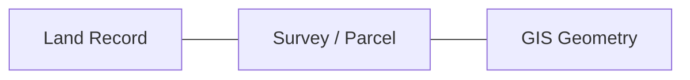

# 14 — GIS and Cadastral Design

> Related: [08-VALIDATION-AND-TRUST-ENGINE](./08-VALIDATION-AND-TRUST-ENGINE.md) · [05-DATABASE-DESIGN](./05-DATABASE-DESIGN.md) · [11-API-AND-GOVERNMENT-INTEGRATION](./11-API-AND-GOVERNMENT-INTEGRATION.md)
> Traces: REQ-GIS-001, REQ-VAL-004

## 1. Purpose

Defines how LANDLENS relates land records to spatial/cadastral data — treated as a validation and analysis input, not merely a decorative map (source prompt §21: "GIS should not be treated as just a map decoration").

## 2. Core Relationship

Where cadastral/parcel geometry is available, a Land Record's survey/khasra reference links through a `Parcel`/`Survey` entity (see [02-DOMAIN-MODEL](./02-DOMAIN-MODEL.md), [05-DATABASE-DESIGN](./05-DATABASE-DESIGN.md)) to its `GISReference` geometry.

## 3. Capabilities (REQ-GIS-001)

| Capability | Description |
|---|---|
| Parcel visualization | Render a parcel's boundary on a map given its geometry. |
| Survey-number lookup | Find a parcel/record by survey number. |
| Record-to-parcel relationship | Navigate from a Land Record to its spatial location and back. |
| Spatial validation | A Validation Check category (see [08-VALIDATION-AND-TRUST-ENGINE](./08-VALIDATION-AND-TRUST-ENGINE.md) §4) — e.g. does the record's stated village match the administrative boundary containing the parcel's geometry. |
| Cadastral map references | Link back to the source cadastral map image/document where the parcel was defined. |
| Location-based search | Search/filter Land Records by spatial area (e.g. within a village boundary, or a drawn region). |
| Future integration | GeoServer/QGIS/OpenLayers as a richer GIS backend beyond the prototype's Leaflet-based viewer. |

## 4. Data Integrity Rule

**[SIH]/[LLD]** LANDLENS must never invent or interpolate coordinates or cadastral geometry that were not present in source data or a genuine reference dataset (source prompt §21: "Do not invent unavailable coordinates or cadastral data"). Where geometry is unavailable, the UI shows an explicit "no spatial data available" state rather than a placeholder pin or fabricated boundary.

## 5. Synthetic Data Transparency

Where the prototype uses synthetic/sample cadastral geometry (because real government cadastral data is not accessible during SIH development), every map view sourced from synthetic data must carry the same "Sample Data" labeling discipline described in [13-UI-UX-SPECIFICATION](./13-UI-UX-SPECIFICATION.md) §6.

## 6. Technology

**[LLD]** The current prototype already uses Leaflet with OpenStreetMap tiles for the GIS page — retained as the base map layer. PostGIS (see [05-DATABASE-DESIGN](./05-DATABASE-DESIGN.md)) stores parcel geometry server-side. Heavier GIS tooling (GeoServer for tile-serving cadastral layers, QGIS for offline authoring/QA of geometry) is suggested by the SIH documentation as a **[FUTURE]** production capability, not required for the prototype's map-viewing needs.

## 7. Prototype vs Production

| | Prototype | Production |
|---|---|---|
| Basemap tiles | CDN-hosted OSM tiles (current codebase) — requires internet connectivity | Self-hosted/offline tile cache for reliability in constrained government-network settings |
| Cadastral geometry | Synthetic/sample data, clearly labeled | Real cadastral data via GIS platform integration, where access is granted |
| Spatial validation | Basic containment/proximity checks against sample boundaries | Full integration with authoritative cadastral service |

## 8. Open Questions

- Availability and licensing of real cadastral geometry for the Pune district prototype context — not confirmed; treated as unavailable by default until confirmed otherwise.
- Coordinate reference system / survey methodology used by the source cadastral maps (affects how geometry should be georeferenced) — requires domain/government clarification.
