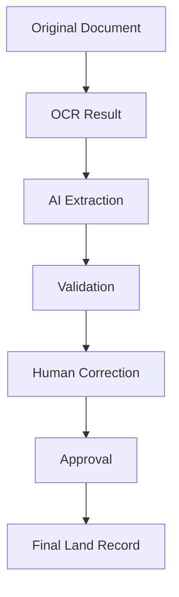

# 15 — Audit and Provenance

> Related: [05-DATABASE-DESIGN](./05-DATABASE-DESIGN.md) · [09-HUMAN-VERIFICATION](./09-HUMAN-VERIFICATION.md) · [16-SECURITY](./16-SECURITY.md)
> Traces: REQ-AUDIT-001

## 1. Purpose

Defines what must be traceable, how, and the immutability guarantee that makes LANDLENS's records defensible as evidence of process (not necessarily legal authority — see [02-DOMAIN-MODEL](./02-DOMAIN-MODEL.md), [11-API-AND-GOVERNMENT-INTEGRATION](./11-API-AND-GOVERNMENT-INTEGRATION.md) §6).

## 2. The Full Provenance Chain (source prompt §22)

Every arrow in this chain must be reconstructable after the fact: given a final Land Record, an auditor can walk backward to the exact original document, page, and bounding box that produced every field value, and every human decision made along the way.

## 3. What Every Audit Event Captures (REQ-AUDIT-001)

| Field | Description |
|---|---|
| **Who** | Actor (User), or explicitly "system" for automated actions |
| **What** | Action type (extracted, validated, corrected, approved, rejected, escalated, exported, etc.) |
| **When** | Timestamp |
| **Previous value** | State before the action (for changes) |
| **New value** | State after the action |
| **Reason** | Free-text or structured reason, especially for corrections/rejections/escalations |
| **Source** | Where the action originated (which pipeline stage, which UI screen, which API call) |
| **Action** | The specific operation performed |
| **Approval level** | AUTO / FIRST / SECOND, where relevant |

## 4. Immutability (REQ-AUDIT-001, links to D-0xx)

**[SIH]/[LLD]** Audit logs are immutable from the normal application interface. Concretely:
- No application role has UPDATE or DELETE privilege on the `AuditEvent` table (enforced at the database permission layer, not only in application code — see [05-DATABASE-DESIGN](./05-DATABASE-DESIGN.md) §4 and [16-SECURITY](./16-SECURITY.md)).
- Any correction to a value creates a *new* record (new RecordField state, new AuditEvent), never an edit of a historical entry.

## 5. What Gets Audited (minimum set)

- Document upload and classification
- Every Processing Stage transition (including failures/retries)
- Extraction results (which model version produced which values)
- Every Validation Run and its checks
- Every Verification Action (accept/correct/reject/reprocess/escalate)
- Every Approval decision at every level
- Every export/sync to an external system
- Administrative actions affecting access (role/scope changes) — see [16-SECURITY](./16-SECURITY.md)

## 6. Audit Consumers

| Role | What they need |
|---|---|
| Auditor | Full read access to audit trails across their organizational scope, for compliance review. |
| Verification/Senior Officer | Their own action history on a record, and the record's full processing history, when reviewing. |
| System Administrator | Access-related audit events (who changed a role/permission) for security review. |
| Future government oversight | Exportable audit trail accompanying any synchronized record, so a receiving system can see LANDLENS's provenance. |

## 7. Relationship to Continuous Learning

Corrections captured here (AI value vs. human value, with reason) are the same data that feeds [18-AI-EVALUATION-AND-CONTINUOUS-LEARNING](./18-AI-EVALUATION-AND-CONTINUOUS-LEARNING.md)'s Training Feedback loop — audit and model-improvement provenance share the same underlying correction record rather than being duplicated.

## 8. Prototype vs Production

- **Prototype:** append-only `AuditEvent` table from day one, even before full RBAC/auth is built out — this is cheap to get right early and expensive to retrofit.
- **Production:** may add tamper-evidence (e.g. hash chaining) and long-term archival/export policies as government retention requirements are clarified.

## 9. Open Questions

- Government record-retention requirements for audit logs (how long must they be kept, in what form) — not specified by SIH docs; flagged in [README](./README.md) as requiring government clarification.
