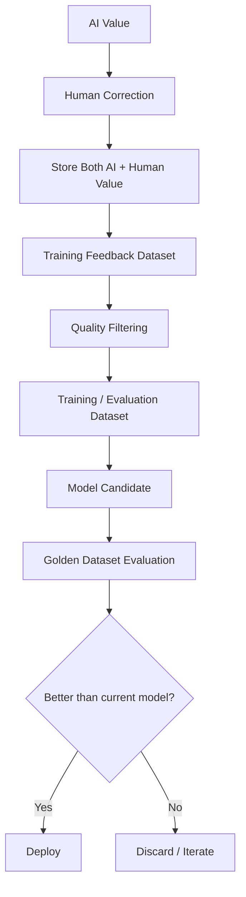

# 18 — AI Evaluation and Continuous Learning

> Related: [06-AI-PROCESSING-PIPELINE](./06-AI-PROCESSING-PIPELINE.md) · [09-HUMAN-VERIFICATION](./09-HUMAN-VERIFICATION.md) · [15-AUDIT-AND-PROVENANCE](./15-AUDIT-AND-PROVENANCE.md)
> Traces: REQ-EVAL-001, REQ-EVAL-002, REQ-AI-003

## 1. Purpose

Defines how LANDLENS measures extraction/validation accuracy and how human corrections feed model improvement **safely** — without ever training directly on live production corrections.

## 2. Golden Evaluation Dataset (REQ-EVAL-001)

**[LLD]**, informed by the existing project documentation's recommendation: an initial golden dataset of **50–100+ annotated documents/records** with ground-truth labels for key fields. This is a proposed starting scale, not an SIH-mandated number.

Critical fields (source prompt §24) requiring especially high accuracy:
- Survey number
- Owner name
- Area
- Khata number (where applicable)

### Metrics Supported

| Metric | Use |
|---|---|
| Precision / Recall / F1 | Standard field-level extraction quality. |
| Exact match | Strict correctness (e.g. survey number must match exactly). |
| Fuzzy match | Appropriate for free-text fields like names, where minor transliteration variance is expected. |
| Confidence calibration | Does the model's stated confidence actually correlate with correctness? Important for tuning SAFE/REVIEW/HIGH-RISK thresholds (see [08-VALIDATION-AND-TRUST-ENGINE](./08-VALIDATION-AND-TRUST-ENGINE.md)). |
| Document-level accuracy | Whole-record correctness, not just per-field. |
| Field-level accuracy | Per-field breakdown, to prioritize improvement effort. |
| Error categories | Classify failures (misread character, wrong field mapping, missed record boundary, etc.) for root-cause analysis. |

**[LLD]** Numerical acceptance thresholds (e.g. "survey number must hit 98% accuracy") are **not asserted as fixed requirements in this document** — the source prompt explicitly warns against inventing final thresholds. Any such number appearing elsewhere (e.g. the current codebase's internal notes) should be treated as a proposed target to validate empirically against the golden dataset, not a guaranteed outcome.

## 3. Continuous Learning Loop (REQ-EVAL-002)

**[SIH]/[LLD]** LANDLENS never retrains production models directly on every incoming correction (source prompt §23 explicitly warns against this). Corrections are:
1. Captured with full provenance (see [09-HUMAN-VERIFICATION](./09-HUMAN-VERIFICATION.md) §6, [15-AUDIT-AND-PROVENANCE](./15-AUDIT-AND-PROVENANCE.md)).
2. Quality-filtered (not every correction is a clean training signal — e.g. a correction made in error itself should be filterable/flaggable).
3. Assembled into a candidate training/evaluation dataset.
4. Used to produce a **model candidate**, evaluated against the golden dataset.
5. Only deployed if it performs at least as well as (ideally better than) the current model — a regression is not shipped just because it's newer.

## 4. Uses of Human Corrections Beyond Retraining

- Evaluation baselines (how well is the *current* model actually doing in production, not just on the golden set).
- Error analysis (which document types, fields, or scripts drive the most corrections — feeds prioritization).
- Document-specific improvements (e.g. discovering a systematic misread pattern for a particular register format).

## 5. Model Versioning

Every deployed model is tracked as a `ModelVersion` (see [05-DATABASE-DESIGN](./05-DATABASE-DESIGN.md)), so extraction/validation results can always be traced to exactly which model produced them — necessary both for evaluation comparisons and for audit provenance.

## 6. Prototype vs Production

| | Prototype | Production |
|---|---|---|
| Golden dataset | Initial 50–100 sample target, manually curated | Larger, continuously expanded dataset, possibly stratified by document era/region/script |
| Evaluation cadence | Manual/ad hoc, run via a script (as the current `evaluate.py` stub anticipates) | Automated evaluation gate in a CI/deployment pipeline before any model promotion |
| Retraining | Likely not performed during the SIH timeline — evaluation only | Scheduled/triggered retraining candidate generation, gated by golden-set comparison |

## 7. Open Questions

- Final acceptance thresholds per critical field — to be determined empirically, not asserted here (see §2).
- Who curates and maintains the golden dataset long-term (a dedicated data/QA role is implied but not defined in the SIH documentation) — organizational question, not a technical one.
