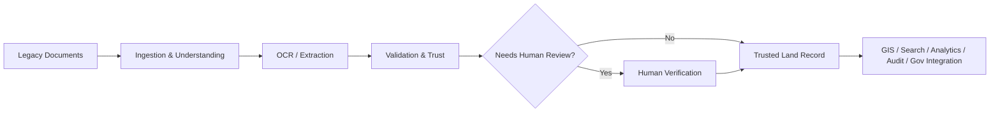

# LANDLENS Documentation

> **LANDLENS — Intelligent Land Record Digitization, Validation and Verification Platform**
> SIH 2026 problem statement — "Intelligent Land Record Digitization and Validation System" (prototype context: Pune district, Maharashtra)

## 1. Overview

LANDLENS turns legacy Indian land records — handwritten registers, scanned PDFs, cadastral maps, historical documents in multiple languages — into **trusted digital land records**, using AI/OCR/Computer Vision/NLP for extraction, a modular validation engine for trust assessment, and exception-driven human verification for anything uncertain or conflicting. It is designed as a full digitization-and-validation platform, not an OCR tool.

This documentation set is the design specification for the next version of LANDLENS, built from: (1) the SIH problem statement, (2) an audit of the existing prototype codebase, and (3) the decisions recorded in [DECISIONS.md](./DECISIONS.md). It is intended as a source of truth for implementation — not itself application code.

## 2. Documentation Map

| # | Document | Covers |
|---|---|---|
| 01 | [PRODUCT-REQUIREMENTS](./01-PRODUCT-REQUIREMENTS.md) | What LANDLENS must do; REQ-ID traceability root |
| 02 | [DOMAIN-MODEL](./02-DOMAIN-MODEL.md) | Canonical terminology and entity relationships |
| 03 | [WORKFLOW-AND-STATE-MACHINE](./03-WORKFLOW-AND-STATE-MACHINE.md) | Document/Record processing states, retries, escalation |
| 04 | [ROLES-AND-RBAC](./04-ROLES-AND-RBAC.md) | Proposed roles, permissions, organizational scope |
| 05 | [DATABASE-DESIGN](./05-DATABASE-DESIGN.md) | Entities, relationships, lifecycle rules |
| 06 | [AI-PROCESSING-PIPELINE](./06-AI-PROCESSING-PIPELINE.md) | End-to-end automated pipeline stages |
| 07 | [OCR-AND-DOCUMENT-UNDERSTANDING](./07-OCR-AND-DOCUMENT-UNDERSTANDING.md) | OCR as one stage of document understanding, not the final answer |
| 08 | [VALIDATION-AND-TRUST-ENGINE](./08-VALIDATION-AND-TRUST-ENGINE.md) | Confidence model, modular validation, risk tiers |
| 09 | [HUMAN-VERIFICATION](./09-HUMAN-VERIFICATION.md) | Verification screen, officer actions, correction provenance |
| 10 | [SYSTEM-ARCHITECTURE](./10-SYSTEM-ARCHITECTURE.md) | Components, data flow, why a durable queue is required |
| 11 | [API-AND-GOVERNMENT-INTEGRATION](./11-API-AND-GOVERNMENT-INTEGRATION.md) | Internal API concept + connector-based government integration |
| 12 | [INFORMATION-ARCHITECTURE](./12-INFORMATION-ARCHITECTURE.md) | Navigation structure, organized by officer task |
| 13 | [UI-UX-SPECIFICATION](./13-UI-UX-SPECIFICATION.md) | Design principles, key screens, error handling |
| 14 | [GIS-AND-CADASTRAL-DESIGN](./14-GIS-AND-CADASTRAL-DESIGN.md) | Spatial validation and parcel/geometry relationships |
| 15 | [AUDIT-AND-PROVENANCE](./15-AUDIT-AND-PROVENANCE.md) | Full traceability chain, immutability |
| 16 | [SECURITY](./16-SECURITY.md) | Auth, RBAC enforcement, secrets, file safety |
| 17 | [ANALYTICS-AND-MONITORING](./17-ANALYTICS-AND-MONITORING.md) | Dashboard metric categories |
| 18 | [AI-EVALUATION-AND-CONTINUOUS-LEARNING](./18-AI-EVALUATION-AND-CONTINUOUS-LEARNING.md) | Golden dataset, gated model improvement loop |
| 19 | [DEPLOYMENT-AND-SIH-ROADMAP](./19-DEPLOYMENT-AND-SIH-ROADMAP.md) | Prototype/production boundary, staged roadmap |
| — | [DECISIONS](./DECISIONS.md) | Design decision log (D-001 …) |

## 3. Recommended Reading Order

1. **01-PRODUCT-REQUIREMENTS** — establishes what's required and the SIH/LLD/FUTURE labeling scheme used throughout.
2. **02-DOMAIN-MODEL** — the vocabulary every other document assumes.
3. **03-WORKFLOW-AND-STATE-MACHINE** — how a document/record actually moves through the system.
4. Then either the **AI track** (06 → 07 → 08 → 18) or the **product track** (04 → 09 → 12 → 13) depending on your role, followed by **05, 10, 11, 14, 15, 16, 17** as reference, and **19** last for the delivery plan.

## 4. Architecture Summary

Officer UI (Next.js/React, retained from the current codebase) → BFF → FastAPI backend (retained) → AI Pipeline Orchestrator + Validation Engine, backed by PostgreSQL+PostGIS, object storage, and a durable job queue (all net-new relative to the current in-memory prototype). Government integration (LRMS/DILRMP/GIS) sits behind a connector abstraction, mocked during the SIH prototype. Full detail in [10-SYSTEM-ARCHITECTURE](./10-SYSTEM-ARCHITECTURE.md).

## 5. SIH Requirement Traceability

Every `REQ-*` ID in this documentation set maps: **SIH requirement → LANDLENS REQ-ID → design document → implementation area**. The root mapping table is in [01-PRODUCT-REQUIREMENTS §7](./01-PRODUCT-REQUIREMENTS.md#7-traceability-chain); each linked document restates the specific REQ-IDs it implements at the top of the file.

## 6. Major Design Decisions

See the full log in [DECISIONS.md](./DECISIONS.md). Highlights:
- Document ≠ Extracted Record ≠ Land Record (D-002)
- Extraction confidence ≠ validation/trust confidence (D-005)
- Human verification is exception-driven, not exhaustive (D-004)
- AI output is never overwritten by human correction — both are retained (D-006)
- Government integrations are connector-based and mocked during the prototype (D-007)
- Retain the existing Next.js/FastAPI stack; add persistence, queueing, and validation depth (D-013)

## 7. Known Assumptions

- The existing prototype's 90% confidence auto-approval threshold is an inherited internal default, not an SIH mandate or a validated figure — treated as tunable configuration pending golden-dataset evaluation.
- Pune district / Maharashtra is the prototype context; field schemas (7/12-style records) are informed by that context but designed to be extensible to other states' formats.
- All roles, designations, and approval-hierarchy names in this documentation are LANDLENS proposals, not confirmed government titles.

## 8. Open Questions (Requires Government Clarification)

Consolidated from all documents:

- Exact LRMS API specifications ([11](./11-API-AND-GOVERNMENT-INTEGRATION.md))
- Exact DILRMP integration method ([11](./11-API-AND-GOVERNMENT-INTEGRATION.md))
- Authoritative reference datasets and access path ([11](./11-API-AND-GOVERNMENT-INTEGRATION.md), [08](./08-VALIDATION-AND-TRUST-ENGINE.md))
- Official organizational hierarchy / approval designations ([04](./04-ROLES-AND-RBAC.md), [08](./08-VALIDATION-AND-TRUST-ENGINE.md))
- Legal status of LANDLENS-digitized records ([02](./02-DOMAIN-MODEL.md), [11](./11-API-AND-GOVERNMENT-INTEGRATION.md))
- Data/audit retention requirements ([16](./16-SECURITY.md), [15](./15-AUDIT-AND-PROVENANCE.md))
- Government cloud/hosting requirements ([10](./10-SYSTEM-ARCHITECTURE.md), [16](./16-SECURITY.md))
- Exact supported document types beyond the initial set ([01](./01-PRODUCT-REQUIREMENTS.md), [06](./06-AI-PROCESSING-PIPELINE.md))
- Exact multilingual/script coverage required ([06](./06-AI-PROCESSING-PIPELINE.md), [07](./07-OCR-AND-DOCUMENT-UNDERSTANDING.md))
- Official validation business rules ([08](./08-VALIDATION-AND-TRUST-ENGINE.md))
- Real cadastral geometry availability/licensing and coordinate reference system ([14](./14-GIS-AND-CADASTRAL-DESIGN.md))
- SIH submission timeline and staging-environment availability ([19](./19-DEPLOYMENT-AND-SIH-ROADMAP.md))

## 9. Prototype vs Production Boundary

See [19-DEPLOYMENT-AND-SIH-ROADMAP §2](./19-DEPLOYMENT-AND-SIH-ROADMAP.md#2-prototype-vs-production--consolidated) for the consolidated table. In short: the prototype may use synthetic reference data, mocked government connectors, simplified authentication, and limited model coverage — always clearly labeled as such — while the architecture is designed so every mocked piece has a defined, non-disruptive swap point for real integration later.

---

*This documentation set does not constitute application code. It is the specification from which implementation should proceed, per the source master prompt's instruction to design before building.*
